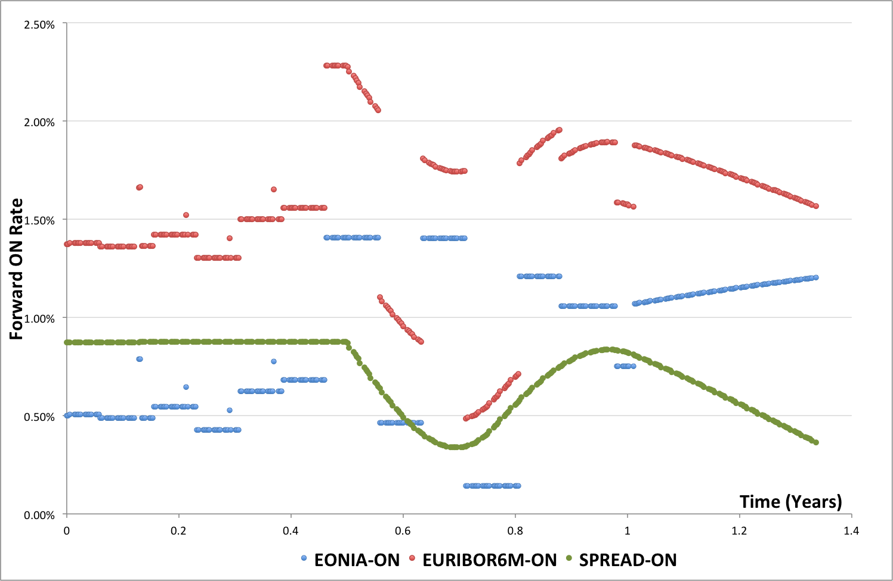

Curve calibration: Central bank meeting and turn-of-year
===============
In this example we construct more involved curve structures in EUR using ECB meeting dates, turn-of-year, multiple interpolation and spreads. The code related to the example can be found in the demo test **MulticurveBuildingDiscountingDiscountEURCommitteeSpreadTest**.

Curve descriptions
------------------
The first curve will be used for discounting and for projecting Eonia rates. The calibration is done on one overnight (deposit) rate and on Overnight Indexed Swaps (OISs).

The second curve is used for projecting EUR EURIBOR 6M rates. The calibration is done on one EURIBOR 6M fixing, FRAs and on interst rate swaps (IRSs) fixed v LIBOR 3M.

Other worked-out examples explain the different parts of the curve calibration procedure: see :doc:`worked-out-example-calibration-simple`, :doc:`worked-out-example-calibration-futures`, :doc:`worked-out-example-calibration-xccy`.

In this workout example we focus on curve description, exogenous dates, interpolators and spreads. We calibrate the same curves with two different *generators* (two different shapes).

**Multiple interpolators**

We start by explaining the line::

    GeneratorYDCurve genComp = new GeneratorCurveAddYield(genCompArray, false)

This create a curve generator which "composed" several other generators. The different curves are composed by addition of the zero-coupon rates. The 'false' in the constructor indicate that the composition is adding and not substracting. ::

   GeneratorYDCurve[] genCompArray = new GeneratorYDCurve[] {genIntNumDFLL, genInt0DFLL, genInt0DQ }

The array of generators contains three generators. The curve we want to create is composed of three different sections. The first part is::

    GeneratorYDCurve genIntNumDFLL = new GeneratorCurveDiscountFactorInterpolatedNumber(MATURITY_CALCULATOR, nbNode1, INTERPOLATOR_LL)

It will be used for the first 2 nodes (ON and TN points). The interpolator is log-linear and it is applied to the discount factor. This type of interpolator creates constant instantaneous forward rates between the nodes. The number of node on which this interpolator is used is passed in the constructor; in this case it is 2 nodes.

The second part is::

    GeneratorYDCurve genInt0DFLL = new GeneratorCurveDiscountFactorInterpolatedAnchorNode(MEETING_ECB_TIME, 
        TimeCalculator.getTimeBetween(CALIBRATION_DATE, 
            ScheduleCalculator.getAdjustedDate(CALIBRATION_DATE, GENERATOR_OIS_EUR.getSpotLag(), TARGET)), 
        INTERPOLATOR_LL);

This part also interpolate log-linearly on the discount factor. The nodes are not constructed from times related to the instruments but are exogenous times passed in the constructor. In this case the times are related to ECB meeting dates. Finally the generator is also referring to an *anchor*. An anchor in this context is an artificial node for which the value is 0. For curve calibration purposed, the anchor is required. Without it, both parts of the curve could be shifted by opposite amounts without changing the total curve. There would be infinitely many solutions to the calibration problem.

The third part is::

    GeneratorYDCurve genInt0DQ = new GeneratorCurveYieldInterpolatedAnchor(MATURITY_CALCULATOR, INTERPOLATOR_DQ)

The curve is interpolated on zero-coupon rates (yield) using a *double quadratic* interpolator. The node points are computed as maturity dates of the different instruments used in the calibration.

This description in three parts will give a curve with ON and TN points, 12 nodes at exogeneously provided dates (ECB dates) up to one year and 5 more points on nodes created from instrument maturities.

**Adding Turn-of-the-year and similar**

On top of the curve described above, in the second calibration, we add a turn-of-year type spread. We create an exogeneous curve with *jumps* at year end and at each next 3 months ends. ::

    LocalDate[] startExoDates = new LocalDate[] {LocalDate.of(2012, 12, 31), LocalDate.of(2013, 1, 31),
      LocalDate.of(2013, 2, 28), LocalDate.of(2013, 3, 29) };
    LocalDate[] endExoDates = new LocalDate[] {LocalDate.of(2013, 1, 2), LocalDate.of(2013, 2, 1),
      LocalDate.of(2013, 3, 1), LocalDate.of(2013, 4, 1) };
    double[] spreadExo = {0.0030, 0.0010, 0.0010, 0.0015 }; // Turn-of-year spread: 30bps
    double[] times = new double[2 * startExoDates.length];
    double[] df = new double[2 * startExoDates.length];
    double[] dfExo = new double[startExoDates.length + 1];
    dfExo[0] = 1.0;
    for (int loopdate = 0; loopdate < startExoDates.length; loopdate++) {
      dfExo[loopdate + 1] = dfExo[loopdate] *
          1.0 / (1 + EONIA.getDayCount().getDayCountFraction(startExoDates[loopdate], endExoDates[loopdate]) * spreadExo[loopdate]);
      times[2 * loopdate] = TimeCalculator.getTimeBetween(CALIBRATION_DATE, startExoDates[loopdate]);
      times[2 * loopdate + 1] = TimeCalculator.getTimeBetween(CALIBRATION_DATE, endExoDates[loopdate]);
      df[2 * loopdate] = dfExo[loopdate];
      df[2 * loopdate + 1] = dfExo[loopdate + 1];
    }
    YieldAndDiscountCurve curveTOY = new DiscountCurve("TOY", new InterpolatedDoublesCurve(times, df, INTERPOLATOR_LINEAR, true));

The different periods dates are hard-coded. The spreads are 30bps at year-end and then 10, 10 and 15bps for the next 3 months ends.

We create a curve called **curveTOY**. This is a curve based on discount factor. For each end-of-month period, we compute a discount factor based on the spread. The discount factor curve is flat between the month-end period. At each of those period, the discount factor is multiplied by the discount factor for the period using the spread as a rate.

From the curve with central bank meeting and three interpolations and this spread curve we create our final curve::

    GeneratorYDCurve genAddFixed = new GeneratorCurveAddYieldFixed(genComp, false, curveTOY);

We add the fixed (not calibrated) curve **curveTOY* to the previous one to construct the final discounting/overnight curve with all the features.

**Forward curve as spread**

We now create the forward curve. It is created as a spread to the existing discounting/overnight curve. The spread is a zero-coupon rate based interpolated curve. The interpolation is *Clamped Cubic Spline*, i.e. cubic spline with first order derivative equal to 0 at each extreme. We chose the clamped cubic spline so the zero-coupon rates are smooth also at the interface between interpolation and extrapolation.

::
    
    GeneratorYDCurve genIntCCS = CurveCalibrationConventionDataSets.generatorYDMatCcs();
    GeneratorYDCurve genAddExistDsc = new GeneratorCurveAddYieldExisiting(genIntCCS, false, CURVE_NAME_DSC_EUR);

We insist that all the description above of curve features are used in the curve calibration process. The jumps at ECB dates, the turn-of-year features, the Libor as a spread of ON are all deeply embedded into the curve descriptions used for calibration. There is no curve manipulation after the calibration. All the special features described in the different workout examples can be combined. There is no restriction on instruments, number of special features, number of curve calibrated simultaneously.

Calibration results
-------------------

A small picture speak more than a long text. Below is the picture of the above calibrated curves. The graph represent the overnight forward rates implied with the discounting curve and by the Euribor 6M forward curve. The graph present also the implied spread between the two.

