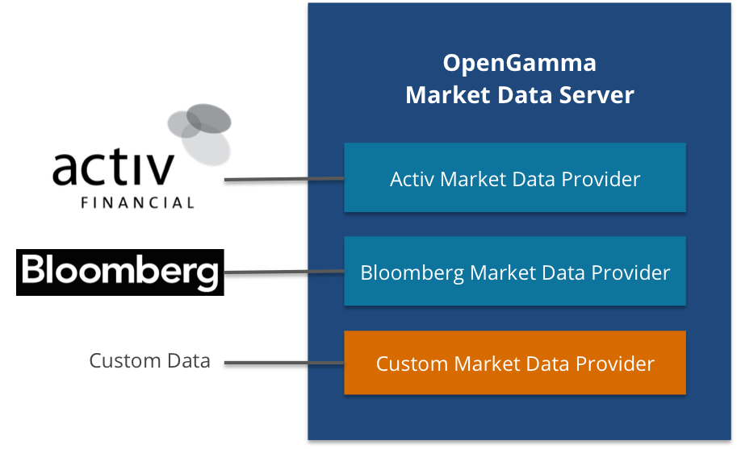

Architecture
============

This is a high-level summary of the modules included in the OpenGamma Platform.
The components listed below are all available under an Open Source license unless explicitly stated.

Components provided by the OpenGamma Platform
---------------------------------------------

**TODO Update diagram**

Data Model
----------

This represents the financial data model under pinning the platform. It described the financial products supported, how to manipulate in the code and persist them

* Security definitions : Asset classes reference data
    * Static and semi-static reference data, e.g. strike, expiry, underlying of an equity option
* Trades
    * Transactional data carrying the economics of the trades themselves, you will need to implement the interfaces to your own data or ETL from your trading system
* Market data
    * Time Series of prices, vol surfaces, etc with support for multiple snapshots per day and multiple data providers per data source
* Holiday schedules
    * Market opening and closing calendars.
* Configuration
    * Curve structures definitions, cross currency conversion matrices, Surface definitions, View definitions etc.

These domain objects all have both an in-memory implementation and one based on at least one RDBMSs -- currently PostgreSQL.
The database representation is also referred to as **Masters** have bi-temporal versioning.

Additional JDBC compliant RDBMS can be implemented via customisation.

See [Data Model] for more information,

Masters
-------

see [Masters] for more information about masters.

Pricing
-------

The Platform includes our clean room, from-scratch implementation of a pricing library from first principles.

* Support for common pricing models
* Pure Java
* Currently has most depth on OTC Cleared, fixed income and credit.

See [Pricing Library] for more information.

Curve Management
----------------

* Broad Interpolations
* Multi-curve framework
* AD

See [Curve Management] for more information.

Calculation Engine
------------------

Each component of the platform are loosely coupled and perform a specific function. Each component exposes a public API and can be used independently.

The calculation engine allows to bring together a data environment (live or snapshot), pricing parameters, curve configuration, and execute in distributed way.

The client facing REST endpoint exposing the pricing functions as callable services are implemented on top of the Engine API

Calculations are fully distributed, and intelligent caching strategies allow very fast computations.

See [OpenGamma Engine] for more information.

Live Data Sources
-----------------

This provides a common interface to data providers and services such as data normalisation.

* Bloomberg support is now available as part of the open source release as Bloomberg have open sourced their base API.
* Thomson Reuters, Activ Financial are available as fully-supported commercial components with source code.
* Custom implementations for proprietary sources of market data are easy to write and full examples are available in the source code distribution.

See [OpenGamma Live Data] for more information.

Deployment
----------

See [Deployment] for more information.

Tools
-----

See [Tools] for more information.
